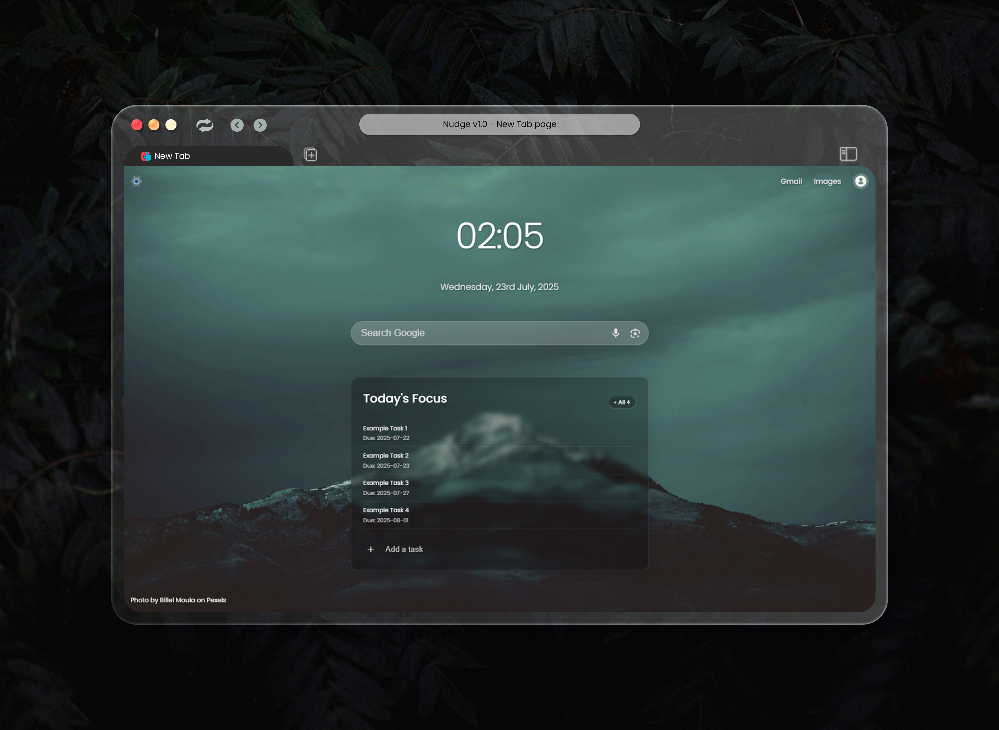
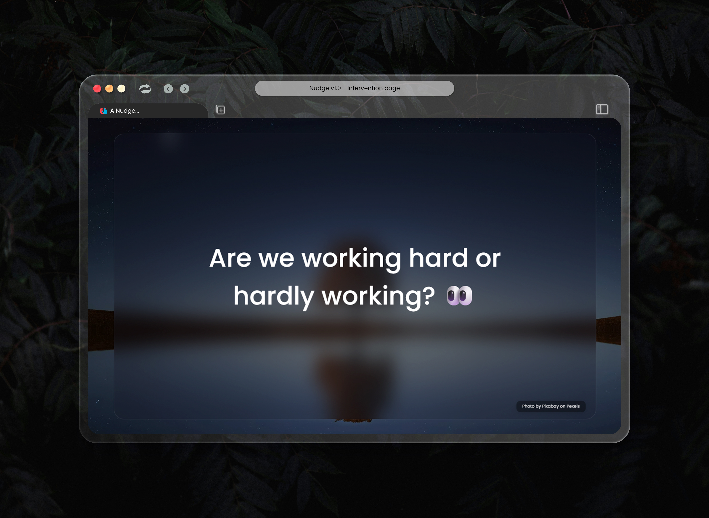
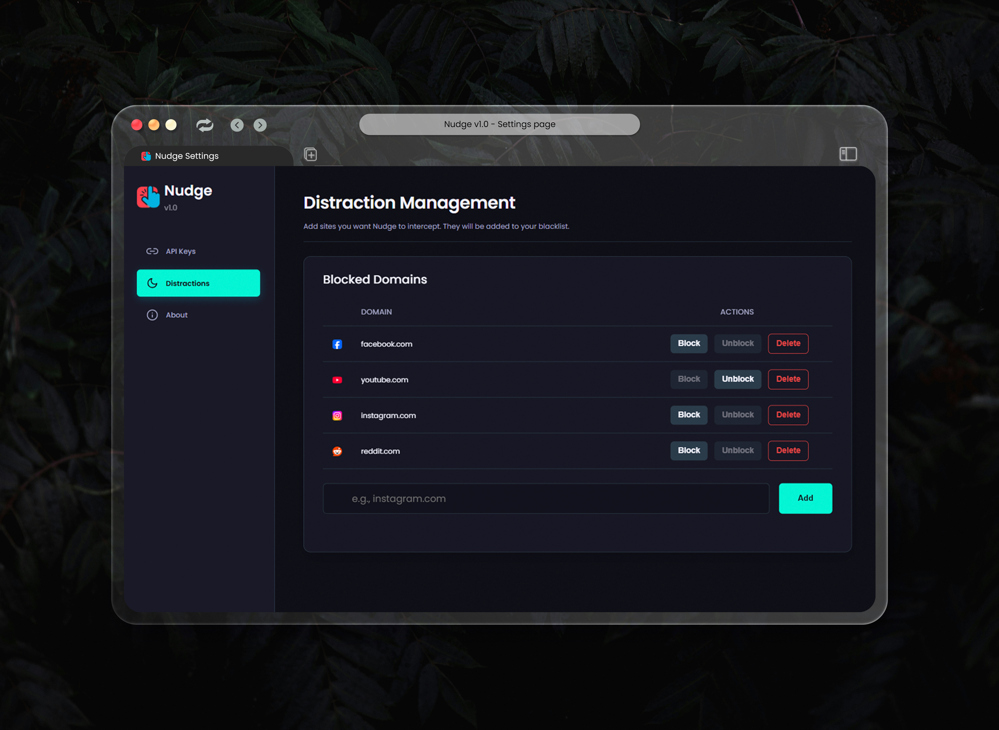

# Nudge v1.0

[](https://opensource.org/licenses/MIT) [](https://github.com/shakibbinkabir/nudge/releases) []()

**Your intelligent and sassy sidekick against procrastination.** Nudge is a productivity-focused Chrome extension that transforms your new tab page into a smart, beautiful, and focused workspace designed to keep you on track.

---


> ✨ **Note:** This is the first stable release (v1.0). Your feedback is highly appreciated!

## About The Project

Do you ever open a new tab with the intent to be productive, only to find yourself mindlessly drifting to social media or YouTube? Nudge was built to solve this exact problem.

It replaces your default new tab with a dashboard that surfaces your most important tasks. More importantly, it acts as a gentle guardian, intercepting visits to distracting websites and "nudging" you back towards your goals. It's not a harsh blocker; it's a flexible companion that helps you build better Browse habits.

### Screenshots




| Gentle Intervention | Powerful Settings |
| :---: | :---: |
|  |  |

---

## Key Features


-   ✨ **Dynamic & Inspiring New Tab Page:** Beautiful, auto-refreshing background images (24-hour cache) to create a calm and focused environment.
-   ✅ **Intelligent Task Prioritization:** To-do list that automatically sorts your tasks by completion status, priority level, and deadline.
-   🚫 **Distraction Management:** Block/unblock and delete distracting websites, with real-time favicon previews and a modern UI.
-   🧘 **Flexible Snooze Functionality:** Temporarily bypass blocks with snooze options and guilt-tracking.
-   ⚙️ **Dual API Key System:** Choose between a free, rate-limited Nudge API key (64/month) or your own Pexels API key for unlimited backgrounds.
-   🖼️ **Dynamic Intervention Page:** A fully animated "frosted glass" UI with motivational messages and your top tasks.
-   🛠️ **Modern "Tech Dashboard" Settings:** A professional settings page with sidebar navigation and a consistent design.
-   📊 **Usage Statistics:** Visual usage bar for Nudge API requests.

---

## How It Works

Nudge operates on two core principles:

1.  **Reinforce Focus:** By replacing the new tab with your prioritized tasks, it constantly reminds you of your goals, making it easier to stay on track.
2.  **Interrupt Distraction:** By redirecting you from a blacklisted site to an animated intervention page, it breaks the mindless habit loop and forces a moment of conscious choice.

### The Nudge API (`lab.shakibbinkabir.me`)


To provide beautiful background images without requiring every user to sign up for a developer account, Nudge uses a proxy API.

-   **How it works:** When you use the "Free API Key" option, the extension communicates with this secure backend, which fetches an image from Pexels and sends it back to you.
-   **Rate Limiting:** The service is rate-limited to **64 background image requests per month** per user.

---


## Installation

1.  Download the `nudge-v1.0.zip` file from the [Releases](https://github.com/shakibbinkabir/nudge/releases) page.
2.  Unzip the downloaded file into a folder on your computer.
3.  Open Google Chrome and navigate to `chrome://extensions`.
4.  Enable **"Developer mode"** using the toggle switch in the top-right corner.
5.  Click the **"Load unpacked"** button.
6.  Select the unzipped folder (the one containing `manifest.json`). The Nudge extension icon should now appear in your extensions bar.

---

## Configuration & Setup

After installation, open the settings page by clicking the Nudge icon in your extensions bar or the gear icon on the new tab page.

#### Option 1: Use the Nudge API (Easy Setup)

1.  On the settings page, navigate to "API Keys."
2.  Enter your email address and click "Get Verification Code."
3.  Check your email for a 6-digit OTP and enter it to verify.
4.  That's it! Your extension is ready to fetch backgrounds.

#### Option 2: Use Your Own Pexels Key (BYOK)

1.  Go to [Pexels.com/api/](https://www.pexels.com/api/) to get your free personal API key.
2.  On the settings page, toggle to the "Use Your Own Pexels Key" option.
3.  Paste your key into the input field and click "Save Pexels Key." The extension will validate it before saving.
4.  This method gives you a much higher personal limit (25,000 requests/month) and does not use the Nudge API service.

---

## For Developers (Building from Source)

Interested in contributing? Here’s how to get the project running.

1.  Clone the repository:
    ```sh
    git clone https://github.com/shakibbinkabir/nudge.git
    ```
2.  The extension code is located in the root of the repository. Follow the **Installation** steps above to load the project directory as an unpacked extension.


---

## Roadmap

-   **v1.1.0:** Data synchronization across devices using `chrome.storage.sync`.
-   **v1.5.0:** Prepare and publish to the Firefox Add-ons store.
-   **Future:** Gamification features (streaks, rewards), advanced customization options, and more based on user feedback.

---

## Contributing

Contributions are what make the open-source community such an amazing place to learn, inspire, and create. Any contributions you make are **greatly appreciated**.

If you have a suggestion that would make this better, please fork the repo and create a pull request. You can also simply open an issue with the tag "enhancement".

1.  Fork the Project
2.  Create your Feature Branch (`git checkout -b feature/AmazingFeature`)
3.  Commit your Changes (`git commit -m 'Add some AmazingFeature'`)
4.  Push to the Branch (`git push origin feature/AmazingFeature`)
5.  Open a Pull Request

---

## License

Distributed under the MIT License. See [`LICENSE.txt`](https://github.com/shakibbinkabir/nudge?tab=MIT-1-ov-file) for more information.

---

## About the Developer

Hey there, I'm Shakib.

I'm a 20-year-old developer from Bangladesh, running on coffee and about a dozen parallel thought processes. My brain is like a browser with 100 tabs open—all of them playing different music. The "one quick YouTube video" often turns into a two-hour deep dive into anything but the code I'm supposed to be writing.

Standard to-do lists felt like a parent nagging me. I didn't need another list; I needed a *sidekick*. Something that would show up at the exact moment of weakness—when that new tab opens—and sassily ask, "Are you *sure* you want to do that?"

So, I built **Nudge**. It’s less of a tool and more of a digital guardian for chaotic minds like mine.

Nudge is the first major experiment from my digital workshop, the **[Lab by Shakib Bin Kabir](https://lab.shakibbinkabir.me)** (still under construction!), where I build solutions for the problems I face every day. It's open-source because I know I'm not the only one fighting this battle. If this sounds like you, check out my other projects or contribute on **[GitHub](https://github.com/shakibbinkabir)**.

Want to see what else I'm up to? You can find more on my **[personal site](https://shakibbinkabir.me)**.

Got ideas, questions, or just want to chat about building tools for beautifully chaotic brains? Drop me a line at **[contact@shakibbinkabir.me](mailto:contact@shakibbinkabir.me)**.
